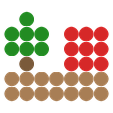

# Aerial LiDAR Classifier

<p align="center"></p>

Deep-learning semantic segmentation of aerial LiDAR point clouds (LAS / LAZ / COPC)
inside QGIS 3.34+ and QGIS 4, with two models:

- **LitePT-L** (default on NVIDIA GPUs): a point transformer from
  [prs-eth/LitePT](https://github.com/prs-eth/LitePT) trained on the
  [DALES](https://arxiv.org/abs/2004.11985) aerial LiDAR dataset at 10 cm.
  Eight classes, custom four-tile DALES test mIoU 0.824.
- **SegFormer 3D** (UrbanFiltering, [TreeAIBox](https://github.com/NRCan/TreeAIBox),
  Natural Resources Canada): a voxel transformer at 30 cm that also runs on the
  CPU and on Apple Silicon.

[](https://qgis.org)
[](https://www.python.org)
[](LICENSE)
[](https://creativecommons.org/licenses/by-nc/4.0/)
[](#hardware-and-platform-support)

Every input point is written back with a class code from the
[ASPRS LAS 1.4](https://www.asprs.org/divisions-committees/lidar-division/laser-las-file-format-exchange-activities)
specification, so PDAL, LAStools, CloudCompare, Potree and QGIS read the result
without any special handling.

> **Learn it with the author.** Abderrazzaq Kharroubi, who wrote this plugin,
> teaches *LiDAR Point Clouds Processing in QGIS*, a live cohort on
> classification, terrain models, COPC and 3D editing.
> [See the syllabus and the next dates](https://maven.com/geomatics/qgis3d?utm_source=github&utm_medium=readme&utm_campaign=qgis3d).
> The course is optional and paid; the plugin is and stays free.

---

## Table of contents

- [Features](#features)
- [Installation](#installation)
- [Quick start](#quick-start)
- [Usage](#usage)
- [Hardware and platform support](#hardware-and-platform-support)
- [Classification output](#classification-output)
- [Coordinate units](#coordinate-units)
- [Tiling, streaming and large files](#tiling-streaming-and-large-files)
- [How it works](#how-it-works)
- [Troubleshooting](#troubleshooting)
- [Model weights](#model-weights)
- [Citation](#citation)
- [License](#license)
- [Credits](#credits)
- [Development](#development)

---

## Features

- **Two models, one interface.** Pick LitePT-L or SegFormer 3D in the dock or
  with the `MODEL` parameter in Processing. If the selected model cannot run
  on the computer, the dock says why and switches to the other one in one click.
- **Nothing to install by hand.** On first use a Setup panel downloads a
  portable Python, PyTorch and the LiDAR libraries into a per-user folder
  (no admin rights), then the model weights. QGIS's own Python is left alone.
- **Weights download by themselves.** Setup fetches them; a model used for the
  first time (dock, Processing or `qgis_process`) fetches whatever is missing.
  Every file is checked against its published SHA-256 before each use.
- **Right PyTorch build for the GPU.** The NVIDIA driver and compute
  capability are read with `nvidia-smi` and the matching CUDA build of PyTorch
  is installed (`cu118` to `cu128`, `cu126` preferred), plus `spconv` for
  LitePT-L. Without an NVIDIA GPU the CPU build is installed. Apple Silicon
  uses MPS (SegFormer 3D).
- **Units handled.** Files in feet are converted from their CRS before
  inference; see [Coordinate units](#coordinate-units).
- **Large files.** Spatial tiling with a context buffer, and a streaming mode
  for files larger than RAM.
- **Processing algorithm** usable from the Toolbox, the Graphical Modeler and
  the `qgis_process` command line.
- **Safe output.** Results are written to a temporary file and published only
  when complete; a batch can never overwrite one of its own inputs.
- **Background execution** with progress, cancel and optional loading of the
  results as point-cloud layers.

---

## Installation

### From the QGIS plugin repository (recommended)

1. *Plugins > Manage and Install Plugins...*
2. Search for **Aerial LiDAR Classifier**. While the plugin is marked
   experimental, tick *Show also experimental plugins* in the *Settings* tab.
3. Click **Install Plugin**.

### From source

```bash
git clone https://github.com/akharroubi/AerialLidarClassifier.git Aerial_LiDAR_Classifier
```

The folder must be named `Aerial_LiDAR_Classifier` (the plugin's package name).
Copy it into your QGIS plugins directory, restart QGIS and enable it in the
plugin manager:

| OS      | QGIS 3 plugins directory |
|---------|--------------------------|
| Windows | `%APPDATA%\QGIS\QGIS3\profiles\default\python\plugins\` |
| macOS   | `~/Library/Application Support/QGIS/QGIS3/profiles/default/python/plugins/` |
| Linux   | `~/.local/share/QGIS/QGIS3/profiles/default/python/plugins/` |

QGIS 4 uses the same paths with `QGIS4` in place of `QGIS3`.

### First launch

The first time you open the plugin, a **Setup** panel shows what it will do
and which models the computer will get. One click on *Install Dependencies*
downloads:

- a standalone Python interpreter (~30 MB) and
  [`uv`](https://github.com/astral-sh/uv), a fast package installer,
- PyTorch and the LiDAR packages (~1 to 3 GB depending on CUDA), plus `spconv`
  (~100 MB) on NVIDIA GPUs,
- the model weights: LitePT-L (~172 MB) on NVIDIA GPUs and SegFormer 3D
  (~18 MB) everywhere.

It usually takes 5 to 15 minutes, and QGIS stays usable meanwhile. Everything
is stored under `~/.qgis_aerial_lidar_classifier/` (the weights under the
QGIS profile) and can be removed at any time.

If the GPU installation fails, the Setup panel offers **Install the CPU version
instead** (SegFormer 3D on the CPU). The plugin never switches from GPU to CPU
by itself.

---

## Quick start

1. Click the plugin's toolbar icon (or *Plugins > Aerial LiDAR Classifier*).
2. Drag `.las` / `.laz` / `.copc.laz` files into the input list, or pick point
   cloud layers already loaded in the project.
3. Choose an output folder (it defaults to the folder of the first file).
4. Click **Run classification**.

The line above the progress bar always says what is still missing before Run,
or what Run will do. When a run ends, the QGIS message bar shows the elapsed
time and an *Open folder* button.

---

## Usage

### Dock panel

- **Model strip** (top): the model selector, its status (ready, weights
  download on first run, needs an NVIDIA GPU, LitePT dependencies missing), the
  compute device, and a folder icon to import a weights file on offline
  machines.
- **Input files**: drop list, *Add files*, *Add folder*, and the loaded-layer
  pickers.
- **Output**: folder, filename suffix (default `_classified`), label field
  (default `classification`), and *Load classified files in QGIS*.
- **Advanced parameters** (collapsed): *Use GPU*, *Clear GPU memory*, tiling
  (auto size or tile size in metres, buffer in metres), *Streaming I/O*, and
  *Input units*.
- **Log** (always visible) and the footer with progress, *Cancel* and *Run*.

### Processing algorithm

The algorithm `aeriallidar:classify_lidar` is available from the
**Processing Toolbox**, the **Graphical Modeler** (the classified file is the
`OUTPUT_FILE` output, ready to chain) and the `qgis_process` command line:

```bash
qgis_process run aeriallidar:classify_lidar -- \
  INPUT=/data/tile.laz OUTPUT_FOLDER=/data/classified \
  MODEL=0 TILE_ENABLED=true TILE_SIZE_M=0 TILE_BUFFER_M=50
```

| Parameter | Values |
|-----------|--------|
| `INPUT` | LAS, LAZ or COPC file |
| `MODEL` | `0` LitePT-L, `1` SegFormer 3D |
| `OUTPUT_FOLDER`, `SUFFIX` | output location, default suffix `_classified` |
| `DEVICE` | `0` Auto, `1` GPU (CUDA), `2` CPU, `3` GPU (Apple MPS) |
| `FIELD_NAME` | `classification` (ASPRS codes) or a new name (raw model classes) |
| `LOAD_AS_LAYER` | add the result to the project |
| `TILE_ENABLED`, `TILE_SIZE_M`, `TILE_BUFFER_M` | tiling; size `0` is automatic (about 10 M points per tile), buffer default 50 m |
| `TILE_STREAMING` | streaming I/O for files larger than RAM |
| `UNITS` | `0` auto-detect, `1` metres, `2` international feet, `3` US survey feet |

The weights download automatically on the first run of a model. The
dependencies themselves are installed once from the dock's Setup panel.

---

## Hardware and platform support

| Environment | Status for 1.1.0 |
|-------------|------------------|
| Windows 10, QGIS 3.44.10 LTR (Qt 5.15), Python 3.12, RTX 3090 | Tested: installer, both models on CPU and CUDA, dock, Processing, Modeler, `qgis_process`, data-integrity suite |
| Windows 10, QGIS 4.2.2 (Qt 6.11, PyQt 6.11), Python 3.12, RTX 3090 | Tested: plugin load, dock, Setup, About, Processing and both models on the same environment |
| Linux x86_64 (Ubuntu under WSL), Python 3.10 | Installer and runtime tested outside the QGIS GUI |
| macOS, Apple Silicon (MPS) | Code path present, not tested; reports welcome |
| GPUs under 8 GB, other GPU generations | Not tested on real hardware; a smaller-crop path and out-of-memory retries exist |

**LitePT-L needs an NVIDIA GPU and `spconv`.** spconv publishes builds for
CUDA 11.8 to 12.6, so the installer prefers `cu126`. RTX 50 cards (Blackwell)
need `cu128`, for which spconv has no build yet: on those cards the dock opens
on SegFormer 3D. LitePT-L processes crops of up to 70,000 points; cards under
8 GB use 35,000-point crops, and a crop that runs out of memory is retried
with half as many points, down to 5,000. Smaller crops can change a few labels.
On an RTX 3090 LitePT-L runs at about 60,000 points per second.

**SegFormer 3D** runs on the CPU, on NVIDIA GPUs and (untested) on Apple MPS.
On the CPU it is much slower than on a GPU but works on any computer.

You never need to install CUDA yourself: the PyTorch wheels carry it.

---

## Classification output

With the default `classification` field, points get ASPRS LAS 1.4 codes.

**LitePT-L** (DALES classes):

| Model class | Name        | ASPRS code | Meaning              |
|------------:|-------------|-----------:|----------------------|
| 1           | Ground      | 2          | Ground               |
| 2           | Vegetation  | 5          | High Vegetation      |
| 3           | Cars        | 1          | Unclassified \*      |
| 4           | Trucks      | 1          | Unclassified \*      |
| 5           | Power lines | 14         | Wire, Conductor      |
| 6           | Fences      | 1          | Unclassified \*      |
| 7           | Poles       | 15         | Transmission Tower   |
| 8           | Buildings   | 6          | Building             |

**SegFormer 3D** (UrbanFiltering classes):

| Model class | Name        | ASPRS code | Meaning              |
|------------:|-------------|-----------:|----------------------|
| 1           | Ground      | 2          | Ground               |
| 2           | Vegetation  | 5          | High Vegetation      |
| 3           | Vehicles    | 1          | Unclassified \*      |
| 4           | Wiring      | 14         | Wire, Conductor      |
| 5           | Fence       | 1          | Unclassified \*      |
| 6           | Pole        | 15         | Transmission Tower   |
| 7           | Building    | 6          | Building             |

\* ASPRS LAS 1.4 has no codes for vehicles or fences. To keep them apart, set
the label field to a new name (for example `ai_label`): the model's own class
numbers above are then written to that extra field, and the input's
`classification` is kept unchanged. Standard LAS dimension names (`X`,
`intensity`, `red`...) are refused as label fields.

What the output keeps:

- the same number of points, in the same order, with the same coordinates,
  scales, offsets, CRS, VLRs and EVLRs, and every other attribute byte for
  byte (including scaled 64-bit extra bytes);
- the input's format: LAS in gives LAS out, LAZ or COPC in gives LAZ out (a
  COPC input becomes ordinary LAZ, since its spatial index would no longer
  match);
- the point format, unless a code above 31 needs LAS 1.4 (formats 0/1 become
  6, 2/3 become 7, 4 becomes 9, 5 becomes 10; RGB is kept and the legacy scan
  angle is kept in an extra field).

A small VLR (`AerialLiDAR`, record 1) records the model, its weights hash, the
field and the class mapping. Files that carry waveform packets are refused
(their relocation is not supported): export a point-only copy first.
Truncated files are refused instead of producing a shorter output.

---

## Coordinate units

The models work in **metres**. Most US LiDAR is delivered in US survey feet;
fed to a model unconverted, every distance is 3.28 times too small, buildings
come out as *Wire, Conductor* and *Transmission Tower*, and the run is about 13
times slower.

The plugin reads the linear unit from the file's CRS (the WKT record of LAS 1.4
files, or the GeoTIFF keys of older files, including a vertical CRS code),
converts XY and Z to metres **for the model only**, and logs what it found:

```
tile.las: coordinate units: XY in US survey foot, Z in US survey foot
(WKT CRS: US survey foot horizontal, US survey foot vertical); converting to metres for the model
```

The output keeps the original coordinates, scales and CRS.

- Without a CRS in the header, metres are assumed and the log says so.
- When the CRS has no vertical part, Z is assumed to share the horizontal unit.
- Geographic files (degrees) are refused, even with a units override: reproject
  them first, for example to the local UTM zone.

To force a unit when the header is missing or wrong, use *Advanced parameters >
Input units* in the dock (auto-detect, metres, international feet, US survey
feet) or the `UNITS` parameter in Processing.

---

## Tiling, streaming and large files

- **Tiling** splits the file into square tiles with a context buffer; only the
  core of each tile is written. Tile size is automatic (about 10 M points per
  tile) or set in metres; the buffer defaults to 50 m. Tiling bounds the work
  handed to the model, but the whole file is still read into RAM.
- **Streaming I/O** (needs tiling; the dock ticks both) reads the file in
  chunks, keeps per-tile points in temporary files on disk, classifies one tile
  at a time and writes the output as it goes. Use it when the file does not fit
  in RAM, with enough free space on a local disk for the temporary files.

Streaming is not a fixed memory budget: a dense tile, its buffer and the model
still need memory, and the predictions take about 2 bytes per point. Run one
job at a time on very large data, and untick *Load classified files in QGIS*
for long batches.

To keep the GPU free for other work, choose SegFormer 3D and untick *Use GPU*
(the CPU then does the work). *Clear GPU memory* releases unused cached memory
between runs.

---

## How it works

**LitePT-L** works on points. Per tile the plugin removes an integer origin,
keeps one representative per occupied 10 cm voxel (with an exact map back to
every raw point), and covers the representatives with crops of at most 70,000
points within 30 m. Each crop is centred, floor-referenced and voxelised like a
validation crop, the network's class probabilities are averaged over every
visit of a point, and the best class is projected back to the raw points. The
upstream code (MIT) is vendored in `core/litept/` with pure-PyTorch replacements
for FlashAttention, `torch_scatter` and the RoPE kernel, so only `spconv` is a
compiled dependency. Checked against the reference implementation: 99.999 % of
3.28 M points identical on an independent tile.

**SegFormer 3D** is the UrbanFiltering 3D SegFormer
([Xi et al., TreeAIBox](https://github.com/NRCan/TreeAIBox)). Points are
voxelised on a 0.3 x 0.3 x 0.2 m grid (occupancy only), the grid is cut into
overlapping blocks of 112 x 112 x 256 voxels, the network labels every occupied
voxel (7 classes), and each point takes the label of its voxel.

Both run inside a QGIS background task, so QGIS stays responsive.

---

## Troubleshooting

Every install and detection step is logged in *View > Panels > Log Messages*
under the **Aerial LiDAR Classifier** tag: start there.

### Repair or reinstall the dependencies

*Plugins > Aerial LiDAR Classifier > Repair dependencies* opens the Setup panel.
If the classifier was already used in this QGIS session, restart QGIS first
(Windows keeps the loaded libraries locked), then run Repair before opening the
classifier.

### The GPU installation failed

Update the NVIDIA driver from
[nvidia.com](https://www.nvidia.com/Download/index.aspx) (Game Ready or Studio
driver, not a partial driver from Windows Update) and click *Reinstall
Dependencies*, or click *Install the CPU version instead*.

### LitePT-L says "Needs an NVIDIA GPU" or "LitePT dependencies missing"

LitePT-L runs only on NVIDIA GPUs with `spconv`. Tick *Use GPU* in *Advanced
parameters*, or click *Use SegFormer 3D* next to the status. On RTX 50 cards
spconv has no build yet; SegFormer 3D is the model there for now.

### Install fails with `WinError 4551` / "Application Control policy"

This is Windows Application Control (AppLocker, WDAC or Smart App Control), an
allow-list enforced by IT. It refuses to run any program that is not on the
list, and neither antivirus exclusions nor `AERIAL_LIDAR_CLASSIFIER_CACHE_DIR`
help. Ask IT:

> Please allow execution under `C:\Users\<my-username>\.qgis_aerial_lidar_classifier\`
> for my account, by adding the folder to the AppLocker / WDAC allow list or by
> signing the python-build-standalone binaries used by this QGIS plugin.

### Install fails with "blocked by antivirus / endpoint-security product"

Windows Defender or another antivirus quarantined the freshly downloaded
`python.exe`. With admin rights, from an elevated PowerShell:

```powershell
Add-MpPreference -ExclusionPath "$env:USERPROFILE\.qgis_aerial_lidar_classifier"
```

Then click *Reinstall Dependencies*. Without admin rights, ask IT for that
exclusion, or move the install to a folder your organisation already allows:

```powershell
[Environment]::SetEnvironmentVariable("AERIAL_LIDAR_CLASSIFIER_CACHE_DIR", "C:\Dev\aerial_lidar_classifier", "User")
```

and restart QGIS.

### Certificate errors behind a corporate proxy

Certificate checks stay on; the installer never downloads packages over an
unverified connection. Install your organisation's root certificate in the
Windows (or system) certificate store, set the proxy in *Settings > Options >
Network*, and retry. SOCKS proxies are not supported by the installer.

### The weights do not download

They download through the QGIS network stack, which uses the proxy and
certificates set in *Settings > Options > Network*. On a machine without
internet access, download the `.pth` file from [Model weights](#model-weights)
elsewhere, then use the folder icon next to the model selector to import it;
the plugin copies it into
`<QGIS profile>/AerialLidarClassifier/models/<model id>/` and checks its
SHA-256.

### Almost everything is classified as wires or towers, or the run is very slow

The file is in feet and its CRS is missing or wrong. Set *Input units* (dock)
or `UNITS` (Processing). See [Coordinate units](#coordinate-units).

### The run uses the CPU although the computer has an NVIDIA GPU

Open *Advanced parameters* and tick *Use GPU*. If the box is greyed out, the
CPU version of PyTorch is installed: run *Repair dependencies* and leave
*Install the CPU version only* unticked.

### `Could not open file as point cloud layer` when loading the result

Your QGIS build lacks the PDAL provider. Open the file with *Layer > Add Layer >
Add Point Cloud Layer*; if that also fails, use a QGIS package that includes
PDAL (the official Windows and macOS installers do).

---

## Model weights

Both files download automatically. The URLs below are for offline machines.

**LitePT-L (DALES, 10 cm)**

| Field         | Value |
|---------------|-------|
| File          | `litept_l_dales_10cm_ema_fp16.pth` (EMA weights of the validation-selected checkpoint, stored as float16, run in float32) |
| Size          | ~172 MB |
| SHA-256       | starts with `849ba5089e62`; the full value is in `core/registry.py` and the plugin checks it automatically |
| URL           | [release v1.1 of this repository](https://github.com/akharroubi/AerialLidarClassifier/releases/tag/v1.1) |
| Training data | DALES (Dayton Annotated LiDAR Earth Scan), 32 tiles; validated on 4, tested on 4 held-out tiles |
| License       | [CC BY-NC 4.0](https://creativecommons.org/licenses/by-nc/4.0/) (licence chosen by the maintainer for the trained weights) |

**SegFormer 3D (UrbanFiltering, 30 cm)**

| Field         | Value |
|---------------|-------|
| File          | `urbanfiltering_als_esegformer3D_112_30cm_GPU3GB.pth` |
| Size          | ~18 MB |
| SHA-256       | starts with `cddb791041d4`; the full value is in `core/registry.py` and the plugin checks it automatically |
| Primary URL   | [NRCan/TreeAIBox release v1.0](https://github.com/NRCan/TreeAIBox/releases/tag/v1.0) |
| Mirror URL    | [release v1.0.0 of this repository](https://github.com/akharroubi/AerialLidarClassifier/releases/tag/v1.0.0) |
| License       | [CC BY-NC 4.0](https://creativecommons.org/licenses/by-nc/4.0/) |

**Commercial use of the model weights requires a separate licence from the
model authors.** The plugin source code is GPL-3.0-or-later.

---

## Citation

If you use this plugin in academic work, please cite the model you used. For
LitePT-L, cite the LitePT architecture (see the
[LitePT repository](https://github.com/prs-eth/LitePT) for the paper) and the
DALES dataset:

```bibtex
@inproceedings{varney2020dales,
  author    = {Varney, Nina and Asari, Vijayan K. and Graehling, Quinn},
  title     = {{DALES}: A Large-scale Aerial LiDAR Data Set for Semantic Segmentation},
  booktitle = {IEEE/CVF Conference on Computer Vision and Pattern Recognition Workshops (CVPRW)},
  year      = {2020},
  url       = {https://arxiv.org/abs/2004.11985}
}
```

For SegFormer 3D:

```bibtex
@misc{xi_treeaibox,
  author       = {Xi, Zhouxin},
  title        = {TreeAIBox: deep learning for forestry and urban LiDAR},
  howpublished = {\url{https://github.com/NRCan/TreeAIBox}},
  organization = {Natural Resources Canada},
  note         = {CC BY-NC 4.0}
}
```

And, optionally, the plugin itself:

```bibtex
@software{kharroubi_aerial_lidar_classifier,
  author       = {Kharroubi, Abderrazzaq},
  title        = {{Aerial LiDAR Classifier}: a QGIS plugin for deep-learning
                  semantic segmentation of aerial LiDAR point clouds},
  year         = {2026},
  url          = {https://github.com/akharroubi/AerialLidarClassifier},
  version      = {1.1.0},
  note         = {GPL-3.0-or-later}
}
```

---

## License

- **Plugin source code**: [GPL-3.0-or-later](LICENSE). The vendored LitePT
  model code (`core/litept/`) is MIT, (c) Photogrammetry and Remote Sensing Lab,
  ETH Zurich (see `core/litept/LICENSE.upstream`).
- **Model weights**: [CC BY-NC 4.0](https://creativecommons.org/licenses/by-nc/4.0/).
  The LitePT-L weights were trained by the plugin maintainer on DALES. The
  SegFormer 3D weights are distributed unchanged from TreeAIBox, whose authors
  permitted their use in this plugin. See
  [THIRD_PARTY_NOTICES.md](THIRD_PARTY_NOTICES.md) for provenance and scope.

---

## Credits

**LitePT-L.** Architecture and reference implementation by the Photogrammetry
and Remote Sensing Lab, ETH Zurich ([prs-eth/LitePT](https://github.com/prs-eth/LitePT)).
Trained on DALES (University of Dayton) by the GeoScITY Lab, University of Liege.

**SegFormer 3D.** The UrbanFiltering 3D SegFormer was developed by
**Zhouxin Xi** (tested by **Charumitha Selvaraj**) at the Canadian Forest
Service, Natural Resources Canada, as part of the
[TreeAIBox](https://github.com/NRCan/TreeAIBox) project. Crown Copyright,
Government of Canada.

**Dependencies.** [PyTorch](https://pytorch.org), [laspy](https://github.com/laspy/laspy),
[spconv](https://github.com/traveller59/spconv), [uv](https://github.com/astral-sh/uv),
[python-build-standalone](https://github.com/astral-sh/python-build-standalone),
[timm](https://github.com/huggingface/pytorch-image-models), and
[QGIS](https://qgis.org) itself.

**Author.** Abderrazzaq Kharroubi, GeoScITY Lab, University of Liege. Bug
reports and pull requests are welcome on the
[issue tracker](https://github.com/akharroubi/AerialLidarClassifier/issues).

**Course.** [LiDAR Point Clouds Processing in QGIS](https://maven.com/geomatics/qgis3d?utm_source=github&utm_medium=readme&utm_campaign=qgis3d),
a live cohort by the author. The plugin links to it from the dock (the card can
be hidden with its x button), the About dialog and the plugin menu. The links
carry fixed campaign tags only; the plugin sends no usage data.

---

## Development

- `python build_zip.py` builds `dist/aerial_lidar_classifier_v<version>.zip`
  with the `Aerial_LiDAR_Classifier` folder (the published package name), a
  fixed file list and a SHA-256 sidecar. The same source gives the same bytes.
- Tests live in `tests/` (not shipped). Pure and model tests run with the
  plugin's Python (`~/.qgis_aerial_lidar_classifier/venv_py3.12`), for example
  `python tests/test_release_safety.py`; the QGIS checks run with QGIS's Python,
  for example `python-qgis-ltr.bat tests/qgis_release_checks.py`.
